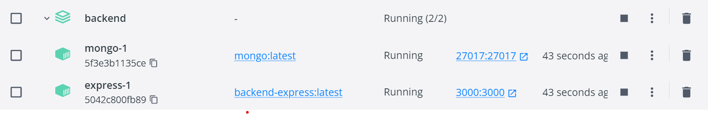

Para este hito se nos ha pedido programar una composición de servicios mediante docker gracias a su archivo docker-compose.yml.

Los dos servicios que levantaremos será el servicio de la API REST que programamos en el hito anterior y el servicio mongo al que se conectará nuestra API.

**API REST**
Para este servicio he tenido que crear un Dockerfile denominado Dockerfile.express cuyo contenido es el siguiente:

`

FROM node
WORKDIR /usr/src/app
COPY package\*.json /usr/src/app
RUN npm install
COPY . /usr/src/app
EXPOSE 3000

`

Como nos hemos dado cuenta, no ha hecho falta un comando RUN ni ENTRYPOINT ya que el comando lo ejecutará el docker-compose una vez levante la imagen.

**DOCKER-COMPOSE**
Una vez tenemos la imagen montada, podemos programar y ejecutar nuestro docker-compose.yml

`version: "3.7"
services:
  express:
    build:
      context: .
      dockerfile: Dockerfile.express
    volumes:
      - .:/app
    environment:
      PORT: 3000
    ports:
      - "3000:3000"
    command: ["node", "index.js"]
  mongo:
    image: mongo
    ports:
      - "27017:27017"
volumes:
  mongodb_data:`

Como podemos observar, nuestro docker-compose levantará dos servicios: express y mongo. Vemos además, como el servicio de express parte del dockerfile que hemos creado anteriormente y cómo lo ejecuta con el comando "node index.js".

El servicio mongo parte a su vez de la imagen base de mongo y escucha en el puerto 27017 que es por el que escucha por defecto.

Una vez tenemos el docker-compose listo simplemente tenemos que ir a la ruta donde se encuentra, inicializar docker (en el caso de que no lo tengamos levantado) y ejecutar el comando:
`docker-compose build`

Una vez finalizado, levantamos los servicios con el comando:
`docker-compose up`

Una vez ejecutado, podemos ir a localhost:3000/api/clients y podemos ver todos los clientes que hay en la BBDD. Como recomendación personal, lo mejor sería usar POSTMAN para probar los distintos endpoints de la API.

Como adición final, podemos ver los servicios que tenemos levantados en docker mediante la propia aplicación:

